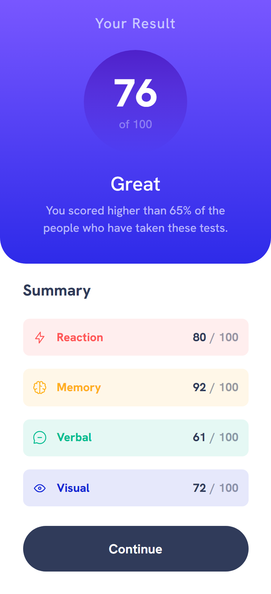
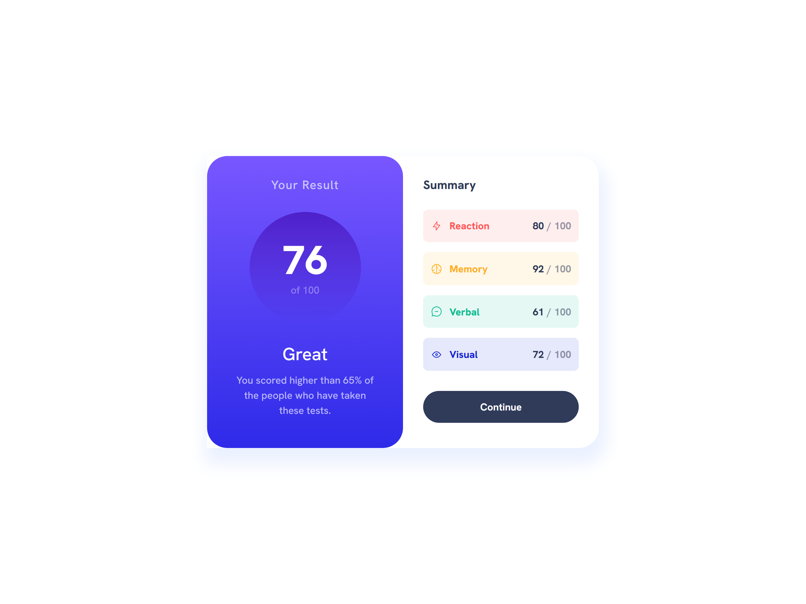

# Frontend Mentor - Results summary component solution

This is a solution to the [Results summary component challenge on Frontend Mentor](https://www.frontendmentor.io/challenges/results-summary-component-CE_K6s0maV). Frontend Mentor challenges help you improve your coding skills by building realistic projects. 

## Table of contents

- [Overview](#overview)
  - [The challenge](#the-challenge)
  - [Screenshot](#screenshot)
  - [Links](#links)
- [My process](#my-process)
  - [Built with](#built-with)
  - [What I learned](#what-i-learned)
- [Author](#author)

## Overview

This is the fifth challenge on the **JavaScript Fundamentals Frontend Mentor Roadmap**. it focuses on styling using html/css and on getting the data of the interface from a local data.json file.

### The challenge

Users should be able to:

- View the optimal layout for the interface depending on their device's screen size
- See hover and focus states for all interactive elements on the page
- **Bonus**: Use the local JSON data to dynamically populate the content

### Screenshot

#### Mobile

#### Desktop

### Links

- Solution URL: [Add solution URL here](https://your-solution-url.com)
- Live Site URL: [Add live site URL here](https://your-live-site-url.com)

## My process

### Built with

- Semantic HTML5 markup
- CSS custom properties
- Flexbox
- CSS Grid
- Mobile-first workflow
- Vanilla JS

### What I learned

I used `fetch` to grab the local json file and svgs. loop over the data and populate each of the score components.

I used the `DOMParser` interface to parse the svg files that are fetched and inject them into the page.

## Author

- Frontend Mentor - [@ilyesab](https://www.frontendmentor.io/profile/ilyesab)
